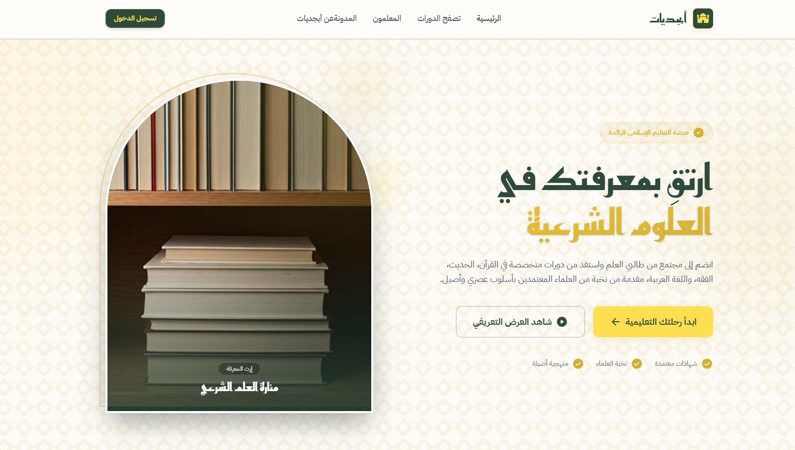
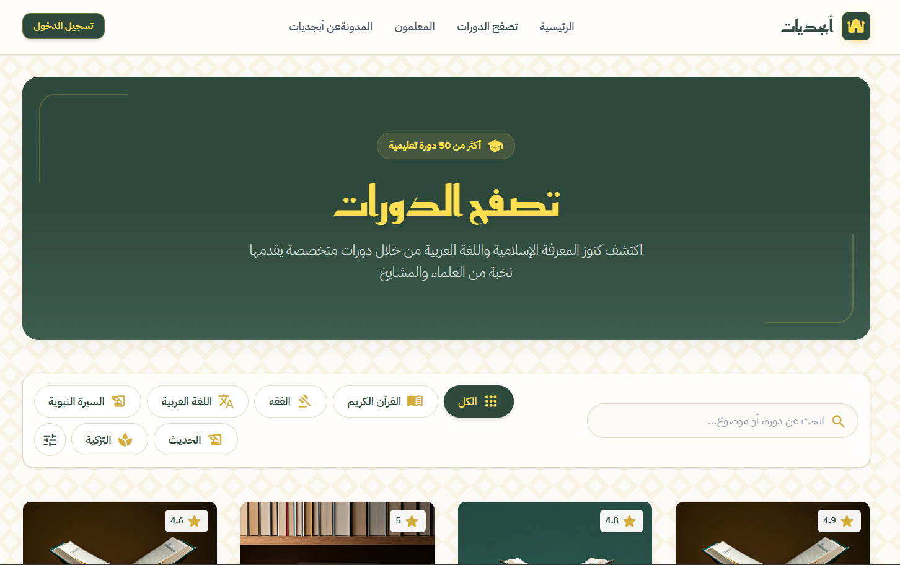

# Abjadiyat - Islamic Educational Platform Documentation





## Overview

**Abjadiyat** (أبجديات) is an Islamic educational platform designed for learning Quranic studies, Islamic sciences, and Arabic language. The application features a modern, RTL (Right-to-Left) Arabic interface with Islamic-themed design elements.

## Tech Stack

- **Vite** - Build tool and development server
- **React 18** - UI library
- **TypeScript** - Type safety
- **Tailwind CSS v4** - Utility-first CSS framework
- **Zustand** - State management with persistence
- **React Router DOM** - Client-side routing

## Project Structure

```
abjadiyat/
├── index.html              # Entry HTML with fonts and RTL setup
├── vite.config.ts          # Vite configuration
├── package.json            # Dependencies and scripts
├── src/
│   ├── main.tsx            # App entry point with BrowserRouter
│   ├── App.tsx             # Main app component with routes
│   ├── index.css           # Global styles and Tailwind theme
│   ├── components/
│   │   ├── ui/             # Reusable UI components
│   │   │   ├── Icon.tsx    # Material icons wrapper
│   │   │   ├── Logo.tsx    # Brand logo component
│   │   │   ├── Button.tsx  # Primary button component
│   │   │   ├── Input.tsx   # Form input component
│   │   │   ├── CourseCard.tsx # Course display card
│   │   │   └── index.ts    # UI exports
│   │   └── layout/         # Layout components
│   │       ├── Header.tsx  # Navigation header
│   │       ├── Footer.tsx  # Site footer
│   │       ├── AuthLayout.tsx # Split layout for auth pages
│   │       ├── MainLayout.tsx # Main page wrapper
│   │       └── index.ts    # Layout exports
│   ├── pages/
│   │   ├── Home.tsx        # Landing page
│   │   ├── Dashboard.tsx   # Student dashboard
│   │   ├── auth/
│   │   │   ├── Login.tsx   # Login page
│   │   │   ├── Register.tsx # Multi-step registration
│   │   │   ├── Success.tsx # Post-auth success page
│   │   │   └── index.ts
│   │   └── courses/
│   │       ├── CourseCatalog.tsx # Course listing
│   │       ├── CourseDetail.tsx  # Single course view
│   │       └── index.ts
│   ├── store/
│   │   └── useStore.ts     # Zustand store
│   ├── types/
│   │   └── index.ts        # TypeScript interfaces
│   └── data/
│       └── mockData.ts     # Mock data for development
```

## Routes

| Path | Component | Description |
|------|-----------|-------------|
| `/` | HomePage | Landing page with hero, features, courses |
| `/login` | LoginPage | User authentication |
| `/register` | RegisterPage | Multi-step registration (3 steps) |
| `/success` | SuccessPage | Post-auth confirmation |
| `/courses` | CourseCatalogPage | Browse all courses |
| `/courses/:id` | CourseDetailPage | Course details and curriculum |
| `/dashboard` | DashboardPage | Student learning dashboard |

## Design System

### Colors

| Token | Value | Usage |
|-------|-------|-------|
| `primary` | `#ffdf52` | Primary accent (gold) |
| `secondary` | `#2e4a3d` | Main text and backgrounds |
| `secondary-light` | `#3d5a4c` | Lighter secondary |
| `accent-gold` | `#d4af37` | Metallic gold accent |
| `background-light` | `#faf8f2` | Light backgrounds |
| `paper` | `#fffef8` | Card backgrounds |

### Typography

- **Display Font**: Reem Kufi - Used for headings and titles
- **Body Font**: IBM Plex Sans Arabic - Used for body text

### Islamic Design Elements

The design incorporates traditional Islamic patterns and motifs:
- Arabesque background patterns
- Mihrab (prayer niche) frame shapes
- Geometric corner ornaments
- Arch-shaped windows
- Gold gradient text effects

## Components

### UI Components

#### Icon
Material Symbols Rounded icon component.
```tsx
<Icon name="school" className="text-lg text-primary" />
```

#### Logo
Brand logo with size variants (sm, md, lg).
```tsx
<Logo size="lg" />
```

#### Button
Primary button with icon support.
```tsx
<Button icon="arrow_right_alt" fullWidth>Continue</Button>
```

#### Input
Form input with icon and label.
```tsx
<Input label="Email" type="email" icon="email" />
```

#### CourseCard
Course preview card with image, title, and metadata.

### Layout Components

#### MainLayout
Wraps pages with Header and Footer.

#### AuthLayout
Split-screen layout for authentication pages with decorative side panel.

## State Management

### Zustand Store

The application uses Zustand for state management with localStorage persistence.

#### State Slices

**Auth State**
- `user`: Current user data
- `isAuthenticated`: Boolean auth status
- `isLoading`: Loading state for async operations

**Registration State**
- `currentStep`: Current registration step (1-3)
- `data`: Collected registration form data

**Course State**
- `selectedCategory`: Active filter category
- `searchQuery`: Current search term
- `enrolledCourses`: List of enrolled course IDs
- `favoriteCourses`: List of favorited course IDs

#### Actions
- `login(email, password)`: Authenticate user
- `logout()`: Clear auth state
- `updateRegistrationData(data)`: Update registration form
- `setRegistrationStep(step)`: Navigate registration
- `completeRegistration()`: Finish registration flow
- `enrollInCourse(id)`: Enroll in a course
- `toggleFavorite(id)`: Toggle course favorite

## User Flows

### Registration Flow

1. **Step 1 - Account Creation**
   - Full name
   - Email address
   - Password & confirmation
   - Terms acceptance

2. **Step 2 - Profile Setup**
   - Country selection
   - Age group
   - Educational level (Beginner/Intermediate/Advanced)

3. **Step 3 - Interests**
   - Select learning interests (Quran, Arabic, Fiqh, etc.)

### Course Enrollment Flow

1. Browse courses in catalog
2. View course details
3. Click "Enroll Now"
4. Access course in dashboard

## Running the Project

### Development
```bash
npm install
npm run dev
```

### Build
```bash
npm run build
```

### Preview Production Build
```bash
npm run preview
```

## File Descriptions

### Configuration Files

**vite.config.ts**
- Configures Vite with React and Tailwind CSS plugins

**index.html**
- Sets up RTL Arabic layout
- Loads Google Fonts (Reem Kufi, IBM Plex Sans Arabic)
- Loads Material Symbols Rounded icons

### Core Files

**src/index.css**
- Tailwind CSS imports
- Custom theme configuration with @theme directive
- Islamic pattern backgrounds
- Custom component styles (mihrab frame, arch window, etc.)
- Animation keyframes

**src/store/useStore.ts**
- Zustand store configuration
- Auth, registration, and course state
- Persistence with localStorage

**src/types/index.ts**
- TypeScript interfaces for User, Course, Instructor, etc.

**src/data/mockData.ts**
- Mock data for courses, instructors, testimonials
- Category filters and form options

## Extending the Application

### Adding New Routes

1. Create page component in `src/pages/`
2. Add route in `src/App.tsx`
3. Export from page index file

### Adding New Components

1. Create component in appropriate folder (`ui/` or `layout/`)
2. Export from folder's `index.ts`
3. Import where needed

### Modifying Theme

Edit the `@theme` block in `src/index.css` to modify:
- Colors
- Shadows
- Fonts
- Animations

## Notes

- All text content is in Arabic
- The application uses RTL (Right-to-Left) layout
- Mock data is used for development - replace with API calls for production
- Authentication is simulated - implement actual auth service for production
